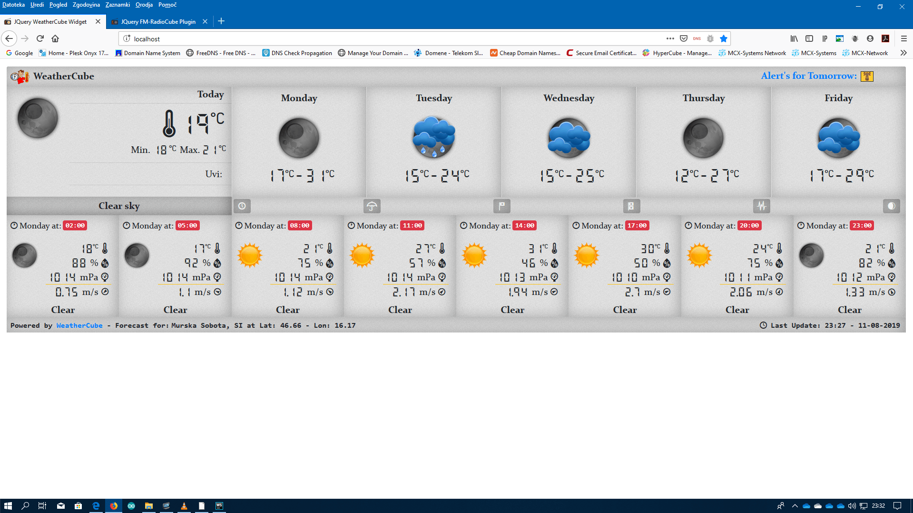

# WeatherCube V1.2.2019

This is a full jquery, bootstrap 4 weather widget.
**It can show you latest weather forecast, charts for latest forecast,
latest earthquakes and charts, moon position, weather alarm, and satellite images.**


It uses multiple api endpoints for collecting the data used.

Used api endpoints are:
- OpenWeatherMap - forecasts, uvi, and map services  https://openweathermap.org/api
- USGS for earthquake data  https://earthquake.usgs.gov/earthquakes/
- MetoAlarm for live weather warning  https://www.meteoalarm.eu/
- sat24 for satellite images  https://en.sat24.com/en
- Naval Oceanography Portal for astronomy data  https://www.public.navy.mil/
--------------------------------------------------------------

```javascript
$(document).ready(function()
{
    $('#weatherCube').weatherCube({
	// OpenWeatherMap apiKey get it here: https://openweathermap.org/api
	apiKey: '',
	// Selected forecast city
	city: 'Murska Sobota',
	// We are using city so coordinates are set to null
	latitude: '',
	longitude: '',
	// language en, sl
	language: 'en',
	// imperial or metric
	units: "metric",
	// EarthQuakes period week or day
	quakesPeriod: "week",
	// default, tick, weezle
	icons: "weezle",
	// weather update interval 2 hours
	wInterval: 7200000,
	// Widget theme light or dark
	theme: 'light',
	// Satellite images
	satImageLocations: [{
		region: "EU",
		type: "visual",
		animated: true
	},
	{
		region: "GR",
	        type: "visual",
		animated: true
	},
	{
		region: "AF",
		type: "visual",
		animated: true
	},
	{
		region: "RU",
	        type: "visual",
		animated: true
	}],
	debug: true
   });
});
```

----------------------------------------------------------------------------------
It's full responsive widget build upon bootstrap 4 and jquery also using leaflet maps an Echarts plugins. 



---------------------------------------------------------------------------------
Eplaining the sat24.com api for satellite images
```
// Images by country PNG
// Link https://api.sat24.com/mostrecent/
// Europe codes DE, SP, FR, ALPS, IT, SCAN, GB, PL, GR, TU, RU, BA, BC, SE, HU, UK, EU
// Africa codes CE, NG, CAF, TD, CG, EG, ET, CM, IS, LY, MG, MO, BW, SA, SO, SD, TZ, TN, WA, ZM, ZA, KE, AO, EA, AF
// Asia codes ID, TH, MY, PG, KR, KP, LA, SEASIA
// Oceania codes NZ, OCE, AU
// America codes ANA, AMA, ASA
// Japan, Taiwan, HongKong, Korea codes JP
// Define map Type visual5hdcomplete, infraPolair, rainTMC, snow
// Link Example
// https://api.sat24.com/mostrecent/BA/visual5hdcomplete or
// https://api.sat24.com/mostrecent/BA/infraPolair
```
```
// Animated by country GIF
// Link https://api.sat24.com/animated/
// Europe codes DE, SP, FR, ALPS, IT, SCAN, GB, PL, GR, TU, RU, BA, BC, SE, HU, UK, EU
// Africa codes CE, NG, CAF, TD, CG, EG, ET, CM, IS, LY, MG, MO, BW, SA, SO, SD, TZ, TN, WA, ZM, ZA, KE, AO, EA, AF
// Asia codes ID, TH, MY, PG, KR, KP, LA, SEASIA
// Oceania codes NZ, OCE, AU
// America codes ANA, AMA, ASA
// Japan, Taiwan, HongKong, Korea codes JP
// Define map Type visual, infraPolair, rainTMC, snow
// Numbers define map size 1-small, 2-medium, 3-large
// Link Example
// https://api.sat24.com/animated/HU/visual/1/
// https://api.sat24.com/animated/BA/infraPolair/2/
```
